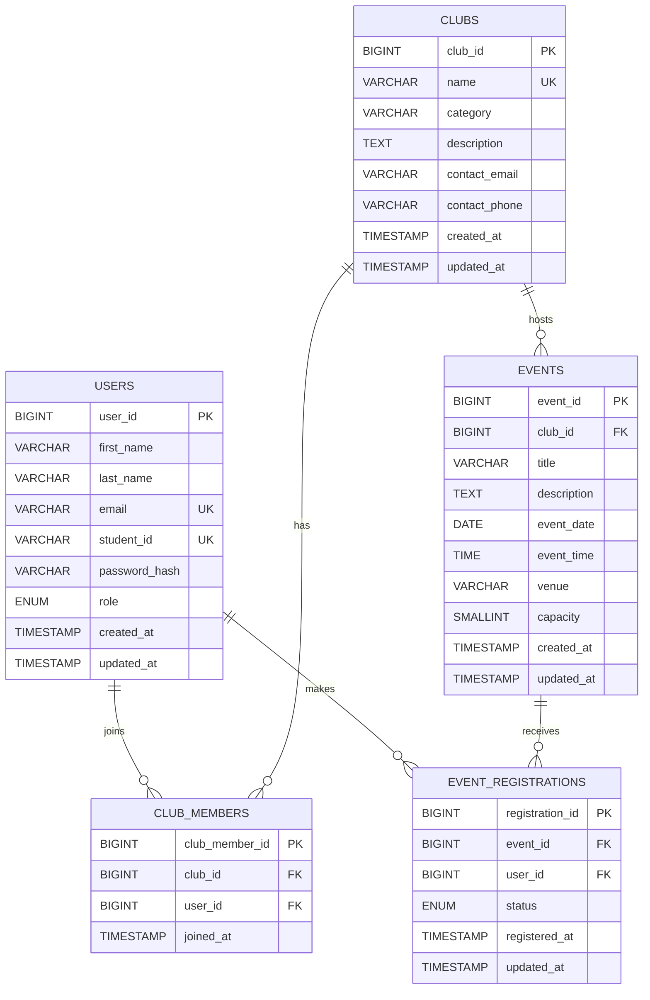

# ClubConnect Entity Relationship Diagram

The database contains exactly five related tables. Users may belong to many clubs and register for many events through the two relationship tables.

## Relationship notes

- `events.club_id` links each event to its hosting club.
- `club_members` resolves the many-to-many relationship between students and clubs.
- `event_registrations` resolves the many-to-many relationship between students and events.
- `UNIQUE (club_id, user_id)` prevents duplicate club memberships.
- `UNIQUE (event_id, user_id)` prevents duplicate event registrations.
- Registration status is restricted to `registered`, `attended` or `cancelled`.
